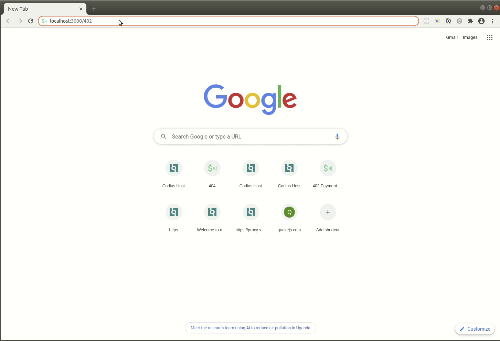

# 402 Page


[Web monetized](https://webmonetization.org) 402 Payment Required error page.



### Run

```
npm install
npm run build
npm start
```

### Environment Variables

All environment variables are optional.

| Environment Variable   | Description                                                                                                                                                                                                                                 |
| ---------------------- | ------------------------------------------------------------------------------------------------------------------------------------------------------------------------------------------------------------------------------------------- |
| `PAYMENT_POINTER`      | [Payment pointer](https://paymentpointers.org/) for Web Monetization payment.                                                                                                                                                               |
| `BALANCE_ID`           | The [receipt verifier](https://github.com/coilhq/receipt-verifier) balance ID.                                                                                                                                                              |
| `BALANCE_ID_HEADER`    | Request header from which to get the balance ID. Case insensitive. Mutually exclusive with `BALANCE_ID`                                                                                                                                     |
| `BALANCE_ID_REGEX`     | Regular expression pattern with a [named capture group](https://developer.mozilla.org/en-US/docs/Web/JavaScript/Guide/Regular_Expressions/Groups_and_Ranges) of `id` to extract the balance ID from the `BALANCE_ID_HEADER`                 |
| `RECEIPT_VERIFIER_URI` | Root URI of the [receipt verifier](https://github.com/coilhq/receipt-verifier)'s `balances` API to which to credit receipts. Requires a balance ID.                                                                                         |
| `REQUIRED_BALANCE`     | The balance amount required to bypass the error page. Denominated in the recipient's asset (code and scale). The page will reload (or redirect if `REDIRECT_URI` is specified) when the balance is reached. Requires `RECEIPT_VERIFIER_URI` |
| `REDIRECT_URI`         | URI to redirect to once the specified balance exceeds the `REQUEST_PRICE`.                                                                                                                                                                  |

#### Examples

##### Static error page

```
npm start
```

##### Web monetized error page

```
PAYMENT_POINTER=$example-wallet.com/account \
npm start
```

##### Balance-tracking web monetized error page

```
PAYMENT_POINTER=$example-verifier.com \
RECEIPT_VERIFIER_URI=https://example-verifier.com/balances \
BALANCE_ID=primary \
npm start
```

###### Host header as balance ID

```
PAYMENT_POINTER=$example-verifier.com \
RECEIPT_VERIFIER_URI=https://example-verifier.com/balances \
BALANCE_ID_HEADER=Host \
npm start
```

###### Subdomain as balance ID

```
PAYMENT_POINTER=$example-verifier.com \
RECEIPT_VERIFIER_URI=https://example-verifier.com/balances \
BALANCE_ID_HEADER=Host \
BALANCE_ID_REGEX="(?<id>.*).example.com" \
npm start
```

##### Auto-reload on sufficient balance

```
PAYMENT_POINTER=$example-verifier.com \
RECEIPT_VERIFIER_URI=https://example-verifier.com/balances \
BALANCE_ID=primary \
REQUIRED_BALANCE=100 \
npm start
```

##### Auto-redirect on sufficient balance

```
PAYMENT_POINTER=$example-verifier.com \
RECEIPT_VERIFIER_URI=https://example-verifier.com/balances \
BALANCE_ID=primary \
REQUIRED_BALANCE=100 \
REDIRECT_URI=https://service.example.com \
npm start
```

### Routes

#### `/402`
